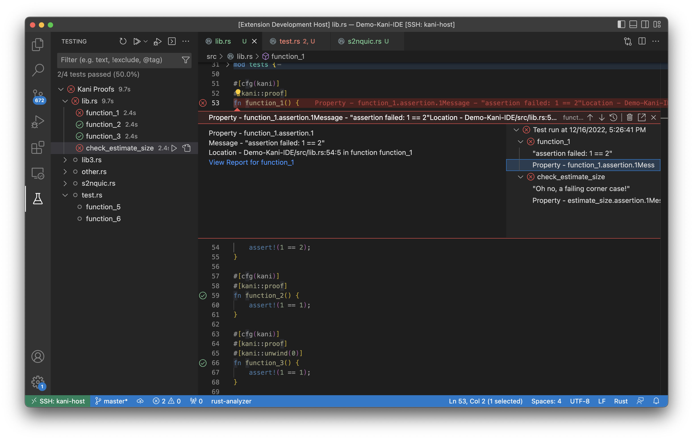
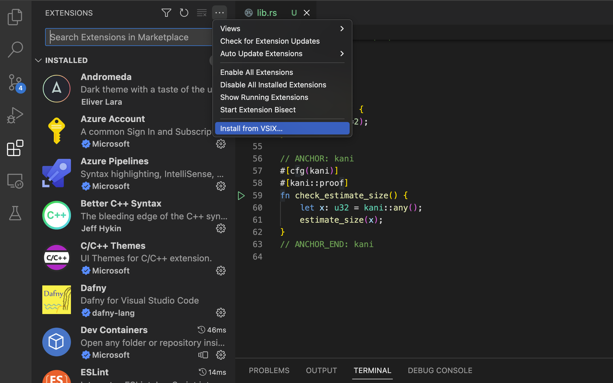

# Kani Visual Studio Code Extension

A Visual Studio Code test extension that allows users to run their [Kani Rust Verifier](https://github.com/model-checking/kani) proofs and view traces natively in vscode.

## Usage

Here's how the kani extension looks like -



1.  Open a rust crate or workspace in Visual Studio Code
2.  Navigate to the testing panel and expand on the Kani Proofs tree where the proofs are stored
3.  Click on the play button beside the harness or the filename or the crate to run Kani on the respective test case.

## Features

-   Run proofs natively the same way you run your test
-   View verification result and failed properties
-   View counter example report for failed proofs

## Requirements

-   Visual Studio Code 1.50 or newer
-   [Kani](https://github.com/model-checking/kani) 0.12 or newer

## Installation

This extension is still in beta and yet to be ready to be published on the marketplace. If you wish to use it now, you can download the binary from the [github page](https://github.com/model-checking/kani-vscode-extension) and install it manually.

### Install through the Binary

The first step would be to install [kani](https://github.com/model-checking/kani#installation) seperately on your local machine before installing the extension.

Download the Kani extension binary from the github page.

You can install an extension from the `.vsix` file opening the `.vsix` file directly from the file explorer as shown in the image below.



Alternatiely,

1.  In VSCode, open the command palette (`Ctrl+Shift+P` or `Cmd+Shift+P` on Mac) and type ext install
2.  Select the `Extensions: Install from VSIX...` command.
3.  In the file dialog that opens, navigate to the locatioon where you downloaded the `.vsix` file and select it.
4.  The extension should be installed and you should see a message in the VS Code output pane saying that the extension was installed succesfully.

You can then enable the extension by going to the extension page on the `Extensions` view in VSCode and and clicking on the `enable` button.

If you want to build from source directly, see [dev-documentation](docs/dev-documentation.md) for more information.


### Packaging

To create a VSIX package of the previously built sources, create the package through the CLI:

```sh
npx vsce package
```

## Troubleshooting

### Stuck at *Verifying...*

There is a known [issue](https://github.com/model-checking/kani-vscode-extension/issues/6) where the extension appears to get stuck if the stack size is too small.
If you experience this issue, you can increase the stack size or stop the verification. We are working to removing the need to increase the stack size.

Here is the workaround for the issue,
The user can set the environment variable `COMPlus_DefaultStackSize` to a sufficiently large value before starting VSCode. For example:

```sh
# Increase the stack size
export COMPlus_DefaultStackSize=100000
# Launch VSCode
code
```

OR

stop the verification using the stop button on the testing panel.

## Security

See [SECURITY](.github/SECURITY.md) for more information.

## License

This code is distributed under the terms of both the MIT license and the Apache License (Version 2.0).
See [LICENSE-APACHE](LICENSE-APACHE) and [LICENSE-MIT](LICENSE-MIT) for details.
