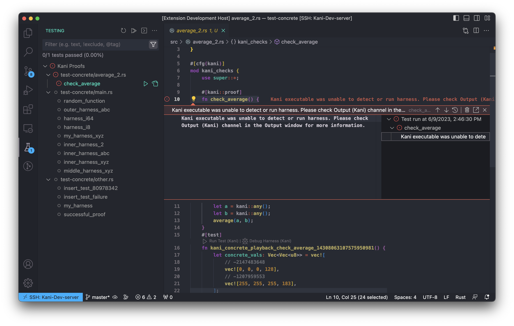

## Troubleshooting

### Kani VSCode extension throws a error message

If the extension throws an error message for a harness that looks like this 
You can inspect the crash logs by going to the output channel and searching for a channel called `Error (Kani) ...`.

If there is no helpful information available there, please file an [issue](https://github.com/model-checking/kani-vscode-extension/issues/new/choose).

### Kani verification seems stuck

If verification seems to be taking too much time, stop the verification using the stop button that looks like a square on the testing panel.

### Output seems unexpected

If the output seems unexpected, it might be because of an old result cached in. It helps to run `cargo clean` and re-running the harness.

### Screen seems frozen

If the screen seems frozen, or inactive, try reloading the vscode window.
