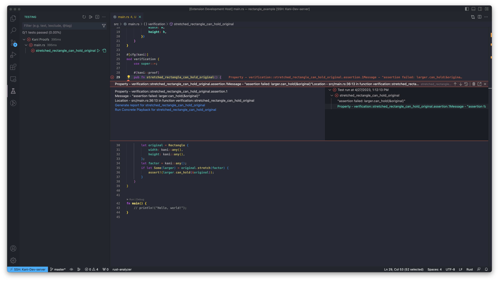

# User Guide

## Features

### How to verify a kani harness using the extension

As soon as the rust file containing the proofs is opened using the Kani extension in a VSCode instance, you should see the Kani proofs loaded as regular unit tests in the Testing Panel on the left border of VSCode. This is how the testing page looks like when you click on the panel.

### Running Proofs

You can then run your proofs using the test tree by clicking the play button beside the harness that was automatically picked up by the Kani Extension. Once you run the proof using the extension, you are shown an error message if the proof has failed. We are then presented with two buttons, to generate the full report for the harness or to run concrete playback to generate unit tests with the counter examples loaded.

<!-- In our running example, as with the command line, we can see through visual markers such as the error banner and red cross, that the harness has failed to verify.

 -->

### View and Debug Proofs through the Trace

You can generate the unit test with the counter examples by clicking on the **Run Concrete Playback for `stretched_rectangle_can_hold_original`** Button that appears through a blue link on the error banner.

You can see that it’s annotated with two buttons that hover over the unit test generated called → Run Test (Kani) | Debug Test (Kani) which allow you to run and debug the test just like any other rust unit test.

### Running Kani-generated test

Running the unit test using the `Run Test (Kani)` button, shows us what we’re expecting–that the current unit test is failing.

### Debug Kani unit test

By simply setting breakpoints and clicking the debug test (kani) button, you are taken into the debugger which allows you to peer into the counter examples or values for which the assert fails.

(**NOTE TO READER -** Try reloading page to view the video).

### Generate HTML report

By 

### Other features

Some other features include -

1. Verify entire crate at once or run your file organized proofs together.
2. Generate HTML report of the trace
3. Keybindings, shortcuts, configurations
4. View output channel
5. View time based logs of the verification
