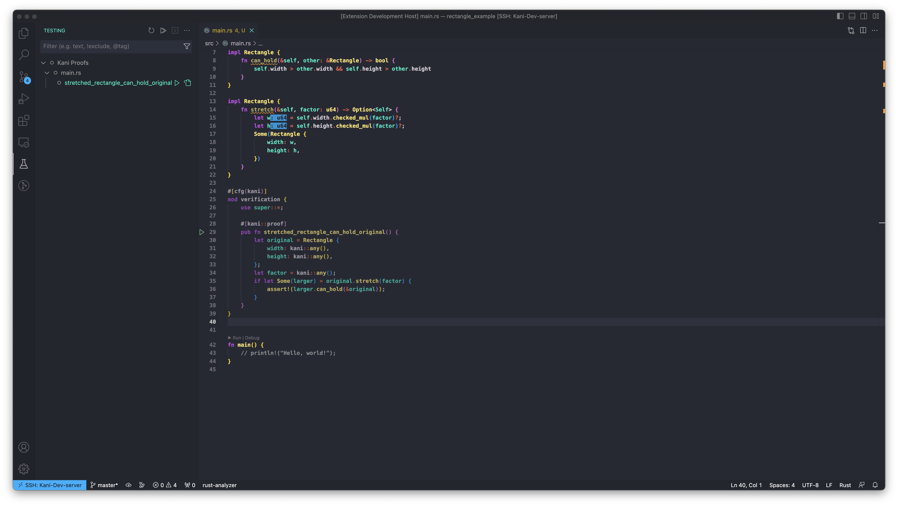
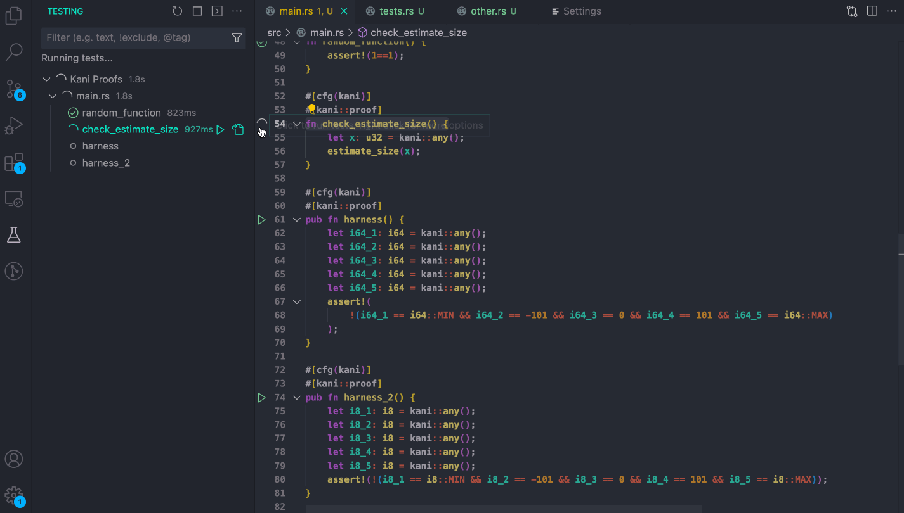
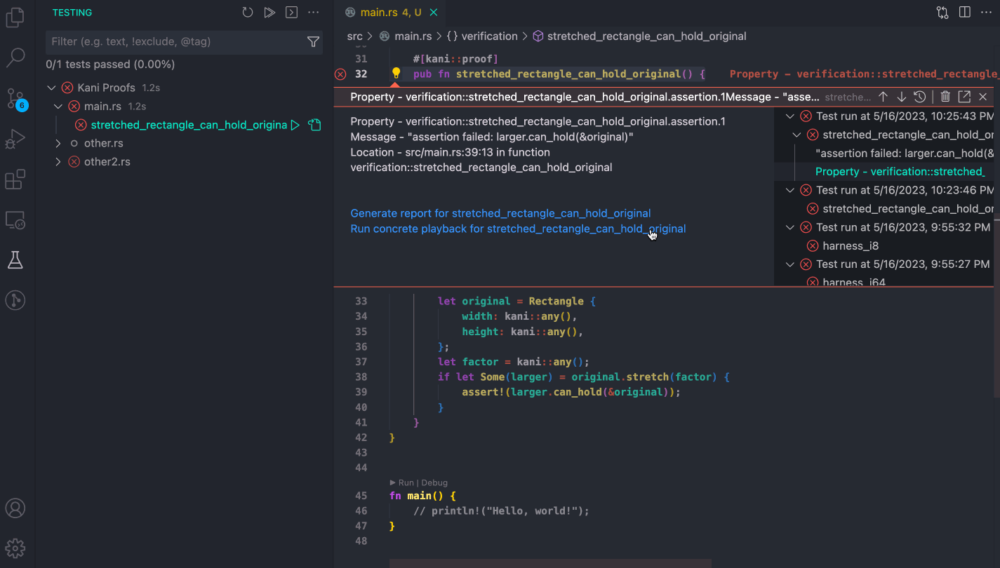
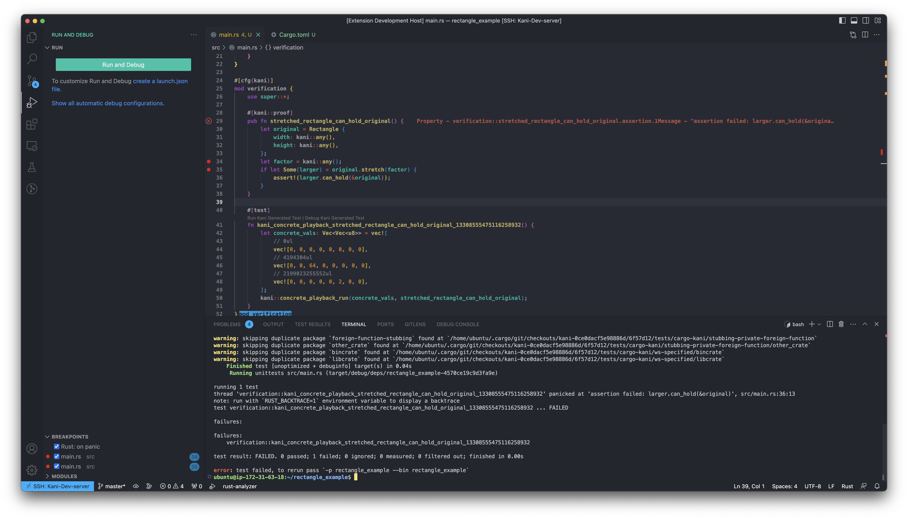
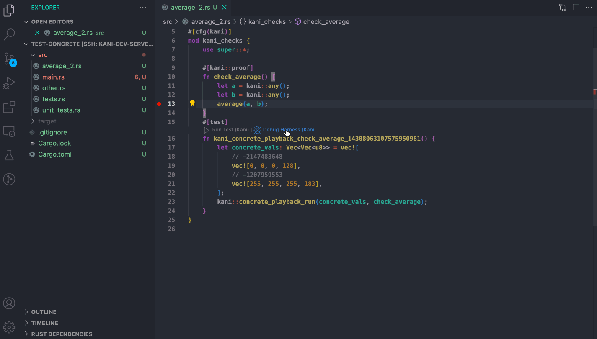
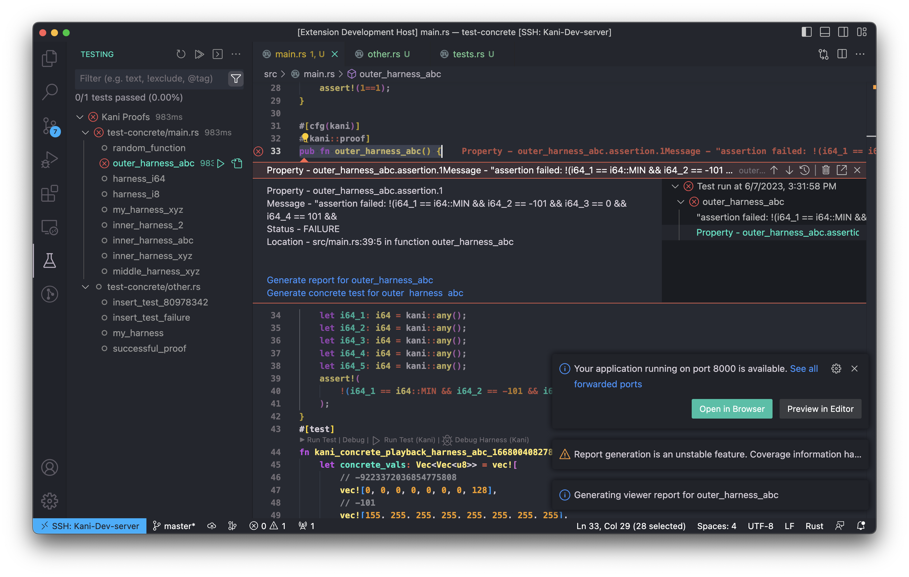
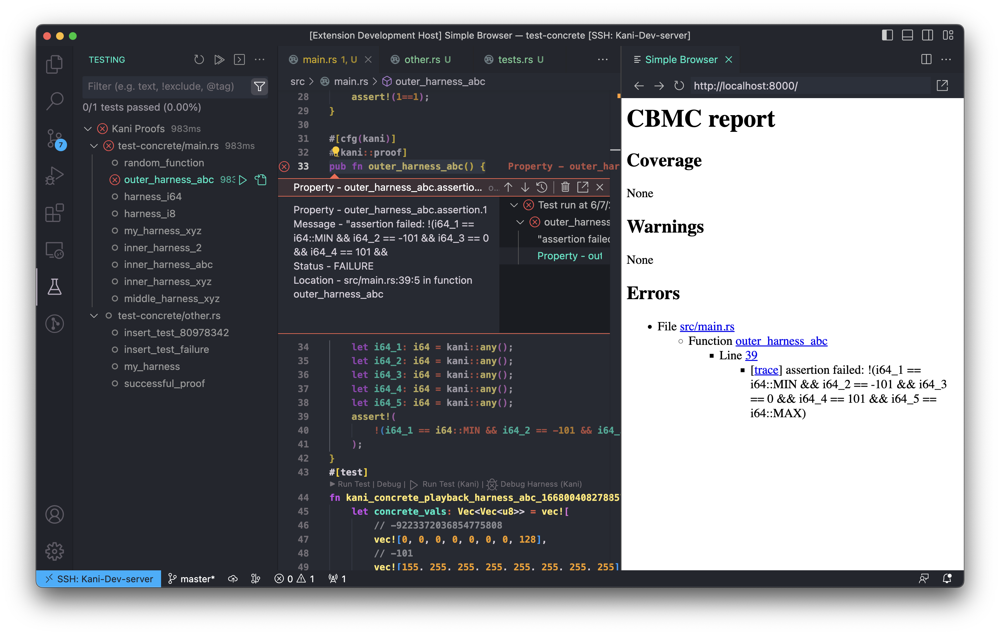
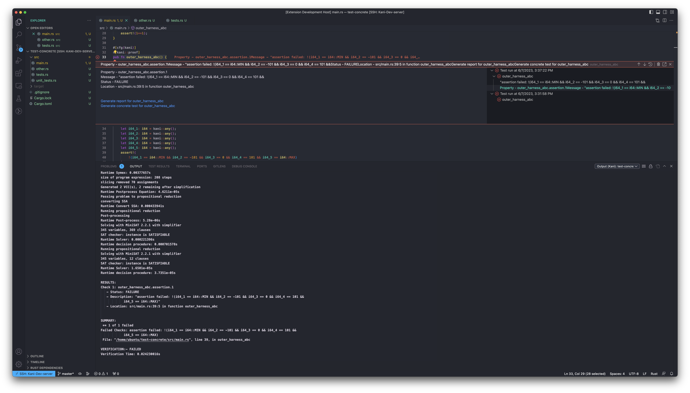
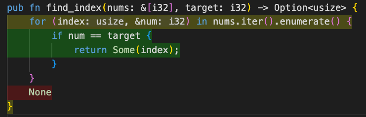
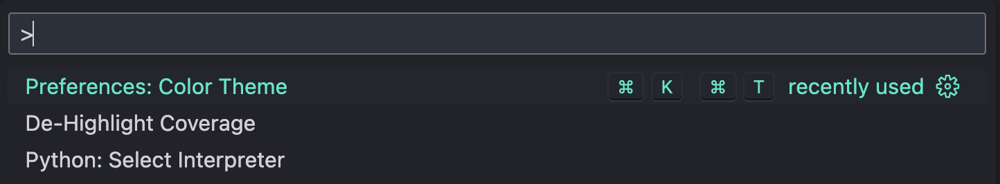

# User Guide

This is the user guide for Kani VSCode Extension.
This guide provides the various workflows that you can use to verify and debug your Kani harnesses.
## Workflows

- [Verify Kani harnesses](#verify-kani-harnesses)
  - [View Kani harnesses](#view-kani-harnesses)
  - [Run Kani harnesses](#run-kani-harnesses)
- [Use Concrete Playback to debug a Kani harness](#use-concrete-playback-to-debug-a-kani-harness)
  - [Generate a counterexample unit test](#generate-a-counterexample-unit-test)
  - [Run Kani-generated unit test](#run-kani-generated-unit-test)
  - [Debug a Kani-generated unit test](#debug-kani-generated-unit-test)
- [View trace report](#view-trace-report)
  - [Generate trace report](#generate-trace-report)
  - [View trace report in window](#view-trace-report-in-window)
- [Kani output logging](#kani-output-logging)
  - [View full Kani output](#view-full-kani-output)
- [Coverage information](#coverage-information)
  - [View coverage information](#view-coverage-information)

### Verify Kani harnesses

#### View Kani harnesses

As soon as the Rust package containing the harnesses is opened using the Kani extension in a VSCode instance, you should see the Kani harnesses loaded as regular unit tests in the testing panel on the left border of the VSCode window.
This is how the VSCode window looks like when you click on the panel:

#### Run Kani harnesses

You can then run your harnesses using the harness tree view by clicking the play button beside the harness that was automatically picked up by the Kani VSCode Extension.
Once you run the harness using the extension, you are shown an error message if the verification fails.
You are then presented with two options:
 1. [Generate the report for the harness](#view-trace-report)
 2. [Run concrete playback to generate unit tests](#use-concrete-playback-to-debug-a-kani-harness).

We are going to describe the flows in detail in their respective sections, but explain the concrete playback feature first.

### Use Concrete Playback to debug a Kani harness

Kani can help you generate unit tests containing the counterexample (also called concrete playback).
These unit tests can help you inspect the trace with the counterexamples and debug your Kani harnesses.

#### Generate a counterexample unit test

You can generate the unit test with the counterexample by clicking on the **`Run Concrete Playback for (your harness name)`** option that appears through a blue link on the error banner.

You can see that the source is annotated with two buttons that hover over the generated unit test called `Run Test (Kani)` and `Debug Test (Kani)` which allow you to run and debug the test just like any other Rust unit test.

#### Run Kani-generated unit test

Clicking the `Run Test (Kani)` button on top of a unit test, runs the unit test generated via concrete playback.

#### Debug Kani-generated unit test

By setting breakpoints and clicking the `Debug Test (Kani)` button, you are taken into the debugger panel which allows you to inspect the trace using the counterexample.

You can then use the debugger controller to step through, into, out of, replay and also change values on the trace panel on the left for interactive debugging.

### View trace report

#### Generate trace report

By clicking the `Generate report for (your harness)` option in the error banner, you can view the trace for the harness in an HTML report.

#### View trace report in window

You can click on the `Preview in Editor` button to view the HTML trace within VSCode.
It should look like this:

### Kani output logging

#### View full Kani output

For every test run, you can view the full output from Kani logged into the output channel as a text file. To view the log, open the output channel, and click on the channel drop down list to view a channel called `Output (Kani): ...`

### Coverage information

Line-based coverage information can be displayed for any harness as in:

To enable the coverage feature in the extension, toggle on the `Codelens-kani: Highlight Coverage` setting in `Settings > Extensions > Kani`.

#### View coverage information

Once the coverage feature is enabled, the `Get coverage info` action should be visible on top of each Kani harness in the project.
Running the `Get coverage info` highlights all lines for which coverage information was obtained.

Coverage information (as described in the [RFC for line coverage](https://model-checking.github.io/kani/rfc/rfcs/0008-line-coverage.html#postprocessing-coverage-checks))  is represented with three colors:
 - **Green:** Indicates `FULL` coverage.
 - **Yellow:** Indicates `PARTIAL` coverage.
 - **Red:** Indicates `NONE` coverage.

**NOTE**: Line-based coverage information is an unstable feature.

#### De-highlight coverage information

To remove or de-highlight the coverage information presented on the UI, open the command palette with `Shift + Command + P` (Mac) / `Ctrl + Shift + P` (Windows/Linux). Then, search for the command `De-highlight coverage`. This should revert the VS Code UI to it's normal state (pre-coverage).

